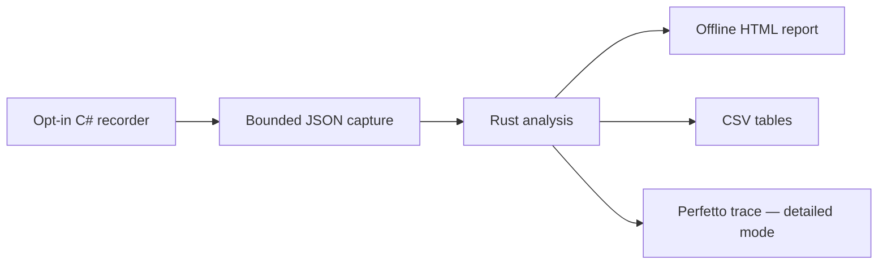

# Phobos Scope

An opt-in profiling and analysis toolkit for game mods, with lightweight recording
adapters, a shared Rust analysis engine, and portable exports for visualization.

The first working slice is **C# recording → JSON capture → Rust analysis → CSV
and Perfetto**. An opt-in Ostranauts adapter now lives in Phobos Framework,
with Auto Nav and Shipbreaker instrumentation. Ordinary gameplay needs no Rust
process or analysis application. In-game verification remains owner-run.

## Start here

New to profiling? Begin with the synthetic demo below; no game is required.
[The walkthrough](docs/getting-started.md) explains each output. For real
Ostranauts captures, use the [integration guide](docs/ostranauts-integration.md).
Questions and redacted bug reports are welcome in
[Issues](https://github.com/phobos-dthorga/phobos-scope/issues/new/choose).
See [support](SUPPORT.md) and [contributing](CONTRIBUTING.md).

This is experimental source, with no prebuilt release currently published.
GitHub's source ZIP is not a ready-to-run executable.



## Try it

Install [Rust through rustup](https://rustup.rs/), the [.NET 10 SDK](https://dotnet.microsoft.com/download/dotnet/10.0)
and [PowerShell 7](https://learn.microsoft.com/powershell/scripting/install/installing-powershell).
On Windows, follow rustup's prompt for the Visual Studio C++ build tools if needed.
Toolchain versions are recorded in `rust-toolchain.toml` and `global.json`.
Clone this repository, open a terminal in its root, then run the demo:

```powershell
git clone https://github.com/phobos-dthorga/phobos-scope.git
cd phobos-scope
```

```powershell
pwsh -File scripts/demo.ps1 -Benchmark
```

This creates a fresh directory under ignored `artifacts/`, containing a synthetic
capture, an HTML report, a deterministic comparison example and an optional
recorder-overhead measurement. It does not overwrite earlier runs. Open
`report/report.html` or `comparison/comparison.html` in a browser. For detailed
timeline inspection, open the generated `report/trace.json` using **Open trace
file** at [Perfetto](https://ui.perfetto.dev), or open `summary.csv` and
`time-series.csv` in LibreOffice Calc. See the [walkthrough](docs/getting-started.md).

```powershell
pwsh -File scripts/verify.ps1
cargo run --release -- validate fixtures/known-detailed.json
cargo run --release -- analyse fixtures/known-detailed.json artifacts/my-report 4
cargo run --release -- compare fixtures/known-detailed.json fixtures/comparison-after.json artifacts/my-comparison
```

The final argument is the time-window width in milliseconds. Output directories
must be new. Summary captures export aggregate and counter/context reports only;
they cannot create a timeline.

## Implemented

- Reusable `phobos-scope-core` library and `phobos-scope` command-line application.
- Versioned JSON capture contract, strict validation and synthetic fixtures.
- .NET Standard 2.1 `Phobos.Scope.Recording`, with no game or NuGet dependencies.
- Disabled-by-default recording, bounded summary/detailed modes, monotonic time,
  nested synchronous scopes, typed counters and timestamped context.
- Calls, inclusive total/mean/maximum durations, calls per real second, incomplete
  scope counts and retained-event time windows.
- Summary/time-series/counter/context CSV, Chrome Trace Event JSON and a JSON
  report carrying metadata and capture-quality warnings.
- Self-contained HTML reports with operation rankings, retained nested timelines,
  counters and workload context; no scripts or remote dependencies.
- Before/after HTML, JSON and CSV comparisons separating call frequency from
  per-call cost, with definition, context, version and quality warnings.
- Repeatable demonstration, verification and microbenchmark scripts; Windows and
  Linux GitHub Actions checks.

## Read before interpreting results

Scopes measure **inclusive real elapsed time**, including nested calls and waits.
They are not exclusive CPU usage or automatic call-stack profiling. Summing nested
operation totals double-counts work. Missing observations remain unavailable.

Complete timing aggregates survive the detailed-event limit. Timeline and window
reports use retained events and explicitly report loss. No percentiles are invented
from aggregates. Recording itself has overhead; see [verification](docs/verification.md).

The initial recorder has one owning thread and synchronous, properly nested scopes.
No `await` inside a scope. Wrong-thread calls are rejected and counted. Adapters
must poll for duration limits and stop at world changes.

## Project map

| Location | Responsibility |
|---|---|
| `crates/phobos-scope-core` | Validation, statistics, windows and exports |
| `crates/phobos-scope` | CLI and file delivery |
| `recording/Phobos.Scope.Recording` | Reusable C# recorder |
| `samples/Phobos.Scope.Sample` | Standalone workload and overhead benchmark |
| `fixtures`, `tests` | Synthetic contract and lifecycle checks |
| `scripts` | Repeatable local and CI workflows |

- [Capture contract](docs/capture-format.md)
- [Project direction and next steps](docs/project-direction.md)
- [Ostranauts integration boundary](docs/ostranauts-integration.md)
- [Original pre-implementation handoff](docs/handoff.md)
- [Contributor instructions](CONTRIBUTING.md)
- [Licensing status](docs/licensing.md) and [dependency provenance](THIRD_PARTY_NOTICES.md)

Original code and documentation are [MIT licensed](LICENSE). Dependencies retain
their [own terms](THIRD_PARTY_NOTICES.md). Conventions follow
[Phobos Ostranauts](https://github.com/phobos-dthorga/phobos-ostranauts): practical
working slices, separate local artifacts and owner-run gameplay tests.
The Ostranauts adapter is implemented and checked with synthetic captures;
gameplay and in-game performance remain unverified.
